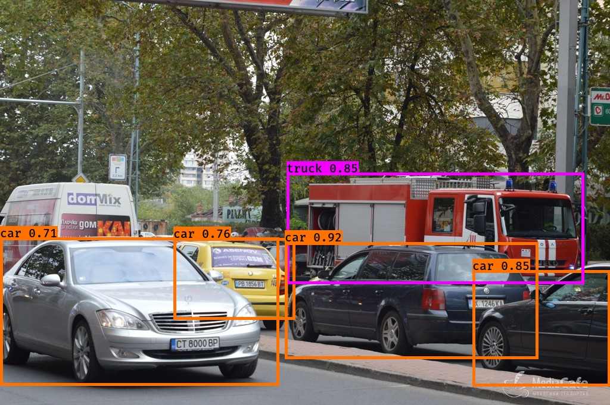

This repo contains some code and a notebook to experiment with the [YOLO algorithm v2](https://pjreddie.com/darknet/yolo/). The notebook explains most of it. The code relies a lot on the code in the [YAD2K repo](https://github.com/allanzelener/YAD2K) and is inspired by the Coursera course on Conv Nets that is part of the deeplearning.ai specialization.

